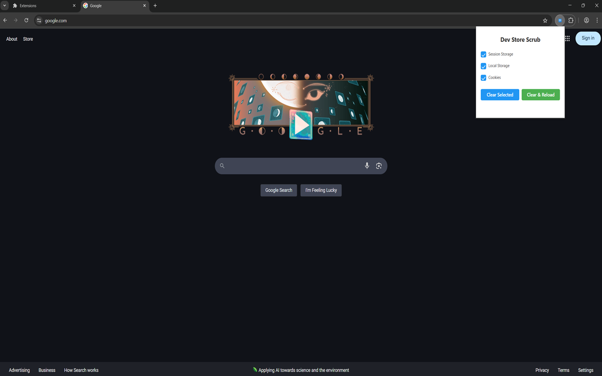

# Dev Store Scrub

A simple yet powerful browser extension for Chrome and Edge that helps developers manage application storage (session storage, local storage, and cookies) in their web applications.

## Features

-   Clear session storage, local storage, or cookies individually or in combination
-   One-click clear and reload functionality
-   Simple checkbox interface for precise control
-   Works entirely locally in your browser
-   No data collection or tracking
-   No external dependencies

## Installation

### Chrome Web Store

1. Visit the [Chrome Web Store (coming soon - currently under review)](#)
2. Click "Add to Chrome"
3. Confirm the installation

### Microsoft Edge Add-ons

1. Visit the [Microsoft Edge Add-on Link](https://microsoftedge.microsoft.com/addons/detail/dev-store-scrub/abmohanoloalofiemekiciipfpcknjpp)
2. Click "Get"
3. Confirm the installation

## Local Development Setup

1. Clone the repository:

```bash
git clone https://github.com/yourusername/dev-store-scrub.git
cd dev-store-scrub
```

2. Load the extension in your browser:
    - Chrome: Navigate to `chrome://extensions/`, enable "Developer mode", click "Load unpacked"
    - Edge: Navigate to `edge://extensions/`, enable "Developer mode", click "Load unpacked"
    - Select the extension directory

## Usage

1. Click the extension icon in your browser toolbar
2. Select the storage types you want to manage
3. Choose your action:
    - "Clear" - Clears selected storage types
    - "Clear & Reload" - Clears selected storage types and reloads the page
4. Keyboard Shortcuts
    - Windows/Linux: `Alt+Shift+S`
    - macOS: `Option+Shift+S`

## MVP



The Minimum Viable Product (MVP) v1.0 includes:

-   Basic storage management functionality
-   Simple and intuitive user interface
-   Cross-browser compatibility (Chrome and Edge)
-   Essential features for developers

## Version Updates

-   1.1.0 - Added keyboard shortcut support for quick access

## Development

1. Clone the repository
2. Open Chrome/Edge and navigate to the extensions page
3. Enable "Developer mode"
4. Click "Load unpacked" and select the project directory

## Contributing

Contributions are welcome! Please feel free to submit a Pull Request.

## License

This project is licensed under the MIT License - see the [LICENSE](LICENSE) file for details.

## Privacy

Dev Store Scrub operates entirely locally in your browser. We do not collect, store, or transmit any personal data. Please read the [privacy policy](privacy-policy.md) for more details.

## Support

For support, feature requests, or bug reports, please contact me.

## Future Roadmap

-   [ ] Add search functionality for storage items
-   [ ] Add ability to view storage contents
-   [ ] Add support for IndexedDB
-   [x] Add keyboard shortcut
-   [ ] Add dark mode support
-   [ ] Add customizable presets for common combinations
